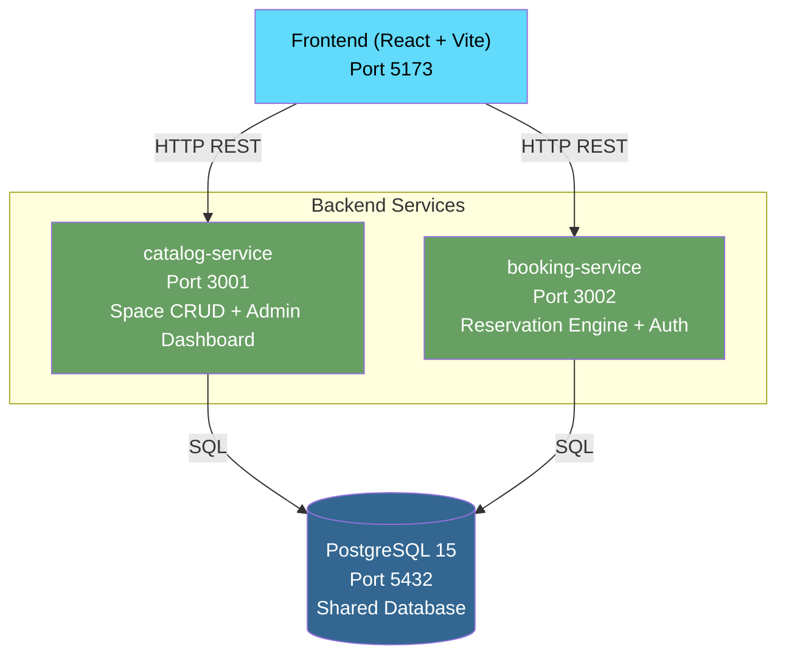

# OfficeSpace - Hybrid Workspace Management System

## Table of Contents
1. [Project Overview](#project-overview)
2. [Business Rules](#business-rules)
3. [Architecture](#architecture)
4. [Tech Stack](#tech-stack)
5. [Prerequisites](#prerequisites)
6. [Installation & Setup](#installation--setup)
7. [Running the Project](#running-the-project)
8. [Test Credentials](#test-credentials)
9. [API Documentation](#api-documentation)
10. [Service Endpoints](#service-endpoints)
11. [Database Schema](#database-schema)
12. [User Guide](#user-guide)
13. [Testing Strategy](#testing-strategy)
14. [Project Structure](#project-structure)
15. [Key Technical Decisions](#key-technical-decisions)

---

## Project Overview

OfficeSpace is an MVP web application that digitizes and automates workspace management for hybrid work environments. It replaces shared Excel-based booking systems with a real-time reservation platform that prevents double-booking, enforces role-based access, and provides administrators with occupancy visibility.

**Core problem solved:** Eliminate overlapping reservations, under-utilized spaces, and uncontrolled access to meeting rooms and hot desks.

**Problems addressed:**
- Lack of visibility over which spaces are occupied today → admin occupancy dashboard.
- Absence of access control and permissions → JWT auth + role-based routes (ADMIN vs COLLABORATOR).
- Double-booking → real-time overlap detection at reservation time.

---

## Business Rules

These rules are enforced server-side (booking-service validators + catalog-service) and reflected in the UI:

1. **Capacity validation** — you cannot book a space for more attendees than its capacity (e.g. 6 people in a room for 4 → `400`).
2. **Schedule validation (the core)** — a reservation is rejected if the space is already booked in that interval. Example: if someone booked 09:00–10:00, you cannot book 09:30–11:00 → `409 Conflict`.
3. **Temporal consistency** — `end_time` cannot be earlier than (or equal to) `start_time` → `400`.
4. **Date validation** — reservations cannot be created in the past → `400`.
5. **Authentication & authorization** — only authenticated users can create reservations; only administrators can manage (create/update/delete) spaces → `401` / `403`.

> **Boundary rule:** consecutive bookings are allowed. 09:00–10:00 and 10:00–11:00 do **not** overlap, because the overlap test (`existing.start < new.end AND existing.end > new.start`) treats the slot end as an exclusive boundary.

---

## Architecture

The system follows a **service-oriented modular architecture** with a shared PostgreSQL database. Two independent backend services communicate via HTTP/REST. This approach was chosen to demonstrate service separation and independent deployability while keeping database transaction complexity manageable within the requirements scope.

> **Architectural note:** This is explicitly a shared-database service pattern, not a full microservices architecture (which would require isolated data stores per service). The tradeoff is accepted intentionally: simpler transactions and faster development over strict service autonomy.



**Service responsibilities:**

| Service | Port | Responsibility |
|---|---|---|
| `catalog-service` | 3001 | CRUD of spaces, admin dashboard data, space availability queries |
| `booking-service` | 3002 | Auth (JWT), reservation engine, overlap validation, user booking history |
| `frontend` | 5173 | React SPA, all 4 required screens |
| `postgres` | 5432 | Shared relational database |

---

## Tech Stack

| Layer | Technology | Rationale |
|---|---|---|
| Frontend | React 19 + Vite + TailwindCSS | Fast build tooling, utility-first CSS, no runtime overhead |
| Backend | Node.js 20 + Express 4 | Minimal setup, async I/O suits booking workloads |
| Database | PostgreSQL 15 | ACID transactions required for overlap conflict prevention; native range query support |
| DB Driver | `pg` (node-postgres) | Raw parameterized queries give explicit control over overlap detection logic |
| Auth | JWT (jsonwebtoken) | Stateless, sufficient for MVP scope |
| API Docs | swagger-jsdoc + swagger-ui-express | Auto-generated interactive docs at `/api-docs` |
| Containers | Docker + docker-compose | Single-command project startup |
| Package Manager | pnpm | Faster installs, disk-efficient with workspaces |

---

## Prerequisites

- Docker Engine 24+
- Docker Compose v2+
- Node.js 20+ (for local development without Docker)
- pnpm 9+ (`npm install -g pnpm`)
- Git

Verify your environment:
```bash
docker --version
docker compose version
node --version
pnpm --version
```

---

## Installation & Setup

### Option A: Docker (Recommended - Single Command)

```bash
# Clone the repository
git clone https://github.com/carlos777g/office-space-gestion-hibrida-inteligente.git
cd officespace-2026

# Start all services (database + both backends + frontend)
docker compose up --build

# On first run, the database is initialized automatically via shared-infra/init-db.sql
```

Wait for all services to report healthy, then access:
- Frontend: http://localhost:5173
- catalog-service Swagger: http://localhost:3001/api-docs
- booking-service Swagger: http://localhost:3002/api-docs

> **Port 5432 already in use?** If you already run PostgreSQL locally, the
> container can't bind the host's 5432 and the stack aborts. Just move the host
> port (the app keeps working — services talk to the DB over the internal docker
> network regardless):
> ```bash
> POSTGRES_HOST_PORT=5433 docker compose up --build
> ```

### Option B: Local Development (Without Docker)

**1. Start PostgreSQL**
```bash
# If PostgreSQL is installed locally on Debian
sudo service postgresql start

# Create the database
psql -U postgres -c "CREATE DATABASE officespace_db;"
psql -U postgres -d officespace_db -f shared-infra/init-db.sql
```

**2. Install dependencies**
```bash
# From project root
pnpm install
```

**3. Configure environment variables**
```bash
# Copy and edit .env files for each service
cp catalog-service/.env.example catalog-service/.env
cp booking-service/.env.example booking-service/.env
cp frontend/.env.example frontend/.env
```

**4. Start everything with a single command (from project root)**
```bash
# Runs catalog-service, booking-service and frontend in parallel
pnpm dev
```

This uses pnpm workspaces (`pnpm -r --parallel run dev`) — no extra terminals needed.
Logs from the three processes are prefixed by package name.

Or start each service individually:
```bash
pnpm dev:catalog     # catalog-service  -> http://localhost:3001
pnpm dev:booking     # booking-service  -> http://localhost:3002
pnpm dev:frontend    # frontend (Vite)  -> http://localhost:5173
```

---

## Running the Project

```bash
# Start everything
docker compose up --build

# Start in background (detached)
docker compose up -d --build

# Stop everything
docker compose down

# Stop and remove database volumes (full reset)
docker compose down -v

# View logs for a specific service
docker compose logs -f booking-service
docker compose logs -f catalog-service
```

---

## Test Credentials

The database is seeded with the following users on initialization:

| Role | Email | Password |
|---|---|---|
| Administrator | admin@corporativoalpha.com | Admin123 |
| Collaborator | carlos.mendez@corporativoalpha.com | User123 |
| Collaborator | ana.torres@corporativoalpha.com | User123 |

---

## API Documentation

Interactive Swagger UI is available when the project is running:

- **catalog-service:** http://localhost:3001/api-docs
- **booking-service:** http://localhost:3002/api-docs

All endpoints require a `Bearer` token in the `Authorization` header, except `POST /auth/login`.

**Quick auth flow:**
```bash
# 1. Get a token
curl -X POST http://localhost:3002/auth/login \
  -H "Content-Type: application/json" \
  -d '{"email": "carlos.mendez@corporativoalpha.com", "password": "User123"}'

# 2. Use the returned token in subsequent requests
curl http://localhost:3001/spaces \
  -H "Authorization: Bearer YOUR_TOKEN_HERE"
```

---

## Service Endpoints

### catalog-service (Port 3001)

| Method | Path | Role Required | Description |
|---|---|---|---|
| GET | /spaces | Collaborator, Admin | List all spaces with optional filters |
| GET | /spaces/:id | Collaborator, Admin | Get single space details |
| POST | /spaces | Admin | Create a new space |
| PUT | /spaces/:id | Admin | Update a space |
| DELETE | /spaces/:id | Admin | Delete a space |
| GET | /spaces/availability | Collaborator, Admin | Find available spaces for a given time window |
| GET | /dashboard/today | Admin | Occupancy summary for today |

### booking-service (Port 3002)

| Method | Path | Role Required | Description |
|---|---|---|---|
| POST | /auth/login | Public | Authenticate user, returns JWT |
| GET | /bookings/my | Collaborator, Admin | Get current user's bookings |
| POST | /bookings | Collaborator, Admin | Create a reservation |
| DELETE | /bookings/:id | Collaborator, Admin | Cancel own reservation (admin can cancel any) |

---

## Database Schema

```sql
-- Users table
users (
  id          SERIAL PRIMARY KEY,
  email       VARCHAR(255) UNIQUE NOT NULL,
  password    VARCHAR(255) NOT NULL,         -- bcrypt hash
  role        VARCHAR(20) NOT NULL,          -- 'ADMIN' | 'COLLABORATOR'
  full_name   VARCHAR(255) NOT NULL,
  created_at  TIMESTAMPTZ DEFAULT NOW()
)

-- Spaces table
spaces (
  id          SERIAL PRIMARY KEY,
  name        VARCHAR(255) NOT NULL,
  type        VARCHAR(20) NOT NULL,          -- 'SALA' | 'DESK'
  capacity    INTEGER NOT NULL,
  floor       VARCHAR(50),
  has_projector    BOOLEAN DEFAULT FALSE,
  has_ac           BOOLEAN DEFAULT FALSE,
  is_active   BOOLEAN DEFAULT TRUE,
  created_at  TIMESTAMPTZ DEFAULT NOW()
)

-- Bookings table
bookings (
  id          SERIAL PRIMARY KEY,
  space_id    INTEGER NOT NULL REFERENCES spaces(id),
  user_id     INTEGER NOT NULL REFERENCES users(id),
  start_time  TIMESTAMPTZ NOT NULL,
  end_time    TIMESTAMPTZ NOT NULL,
  attendees   INTEGER NOT NULL,
  status      VARCHAR(20) DEFAULT 'ACTIVE',  -- 'ACTIVE' | 'CANCELLED'
  created_at  TIMESTAMPTZ DEFAULT NOW(),

  -- Database-level constraint: end must be after start
  CONSTRAINT chk_time_order CHECK (end_time > start_time)
)

-- Index to optimize overlap detection queries
CREATE INDEX idx_bookings_space_time
  ON bookings (space_id, start_time, end_time)
  WHERE status = 'ACTIVE';
```

**Overlap detection query (the critical logic):**
```sql
SELECT id FROM bookings
WHERE space_id = $1
  AND status = 'ACTIVE'
  AND start_time < $3    -- new booking's end_time
  AND end_time > $2;     -- new booking's start_time
-- If this returns any row, the new booking must be rejected with 409 Conflict.
```

---

## User Guide

### 1. Logging in
1. Open the frontend at http://localhost:5173.
2. Enter your email and password (see [Test Credentials](#test-credentials)).
3. On success you are redirected to **Buscar** (Search). Your session (JWT) is stored in the browser and attached automatically to every request.
4. Use **Salir** (top-right) to log out at any time.

### 2. Searching and booking a space (Collaborator & Admin)
1. Go to **Buscar**.
2. Pick a **date**, **start** and **end** time, and optionally filter by **type** (Sala/Escritorio) or **minimum capacity**.
3. Click **Buscar** — only spaces that are *free* for that exact window are listed (overlapping ones are hidden).
4. Click **Reservar** on a space to open the confirmation screen.
5. Set the **number of attendees** (must not exceed the space capacity) and click **Confirmar reserva**.
   - If someone reserved the same slot in the meantime, you get a clear conflict message (`409`) — pick another time.
6. You are redirected to **Mis reservas**, where the new booking appears.

### 3. Managing your bookings
1. Go to **Mis reservas** to see all your reservations (active and cancelled).
2. Click **Cancelar** on an active booking to release the slot. Cancelled slots become bookable again immediately.

### 4. Administering spaces (Admin only)
The **Admin** tab only appears for users with the `ADMIN` role.
1. **Occupancy dashboard** — top of the page shows today's totals (total / occupied now / free) plus a per-space card grid marking each space as **Ocupado** or **Libre**, with its booking count for the day.
2. **Spaces table** — full list of spaces with capacity, floor and equipment.
3. **Create** — click **Nuevo espacio**, fill the form (name, type, capacity, floor, projector, A/C) and **Guardar**.
4. **Edit** — click **Editar** on a row to update any field.
5. **Delete** — click **Eliminar** (soft delete; booking history is preserved).

> Collaborators who try to reach `/admin` are redirected to Search, and admin-only API calls return `403`.

---

## Testing Strategy

### Priority Order (requirements scope)

1. **Postman Collection** — `docs/postman_collection.json`
   - Automated test scripts on each request
   - Covers all critical paths and edge cases
   - Can be run with Newman: `newman run docs/postman_collection.json`

2. **Manual Test Cases** — `docs/test-cases.md`
   - 10+ documented scenarios with preconditions, steps, and expected results
   - Covers overlap logic, auth enforcement, capacity validation

3. **Gherkin Scenarios** — `docs/features/`
   - BDD scenarios for the 5 critical business rules
   - Executable via Cucumber if time permits

4. **Supertest Integration Tests** — `booking-service/src/__tests__/`
   - Unit tests for the overlap detection logic
   - Run with: `pnpm test` inside booking-service

### Critical Test Scenarios

| ID | Scenario | Expected Result |
|---|---|---|
| TC-001 | Book space A from 09:00-10:00, then attempt 09:30-10:30 | 409 Conflict |
| TC-002 | Book space A from 09:00-10:00, then attempt 10:00-11:00 (consecutive) | 201 Created (no overlap) |
| TC-003 | Attempt to book with end_time before start_time | 400 Bad Request |
| TC-004 | Attempt to book a past date/time | 400 Bad Request |
| TC-005 | Book a space for more attendees than capacity | 400 Bad Request |
| TC-006 | POST /bookings without Authorization header | 401 Unauthorized |
| TC-007 | POST /spaces as COLLABORATOR role | 403 Forbidden |
| TC-008 | DELETE /bookings/:id for a booking owned by another user (as collaborator) | 403 Forbidden |
| TC-009 | GET /spaces with capacity filter (e.g. minimum 6) | Only spaces with capacity >= 6 |
| TC-010 | Cancel a booking and rebook the same slot | 201 Created |

---

## Project Structure

```
officespace-2026/
├── catalog-service/
│   ├── src/
│   │   ├── controllers/
│   │   │   ├── spaces.controller.js
│   │   │   └── dashboard.controller.js
│   │   ├── routes/
│   │   │   ├── spaces.routes.js
│   │   │   └── dashboard.routes.js
│   │   ├── services/
│   │   │   └── spaces.service.js
│   │   ├── middleware/
│   │   │   └── auth.middleware.js
│   │   ├── db/
│   │   │   └── pool.js
│   │   └── app.js
│   ├── .env.example
│   ├── Dockerfile
│   ├── package.json
│   └── README.md
│
├── booking-service/
│   ├── src/
│   │   ├── controllers/
│   │   │   ├── auth.controller.js
│   │   │   └── bookings.controller.js
│   │   ├── routes/
│   │   │   ├── auth.routes.js
│   │   │   └── bookings.routes.js
│   │   ├── services/
│   │   │   ├── auth.service.js
│   │   │   └── bookings.service.js
│   │   ├── validators/
│   │   │   └── booking.validator.js
│   │   ├── middleware/
│   │   │   └── auth.middleware.js
│   │   ├── db/
│   │   │   └── pool.js
│   │   └── app.js
│   ├── .env.example
│   ├── Dockerfile
│   ├── package.json
│   └── README.md
│
├── frontend/
│   ├── src/
│   │   ├── components/
│   │   │   ├── ProtectedRoute.jsx
│   │   │   └── Navbar.jsx
│   │   ├── pages/
│   │   │   ├── LoginPage.jsx
│   │   │   ├── SearchPage.jsx
│   │   │   ├── BookingConfirmPage.jsx
│   │   │   ├── MyBookingsPage.jsx
│   │   │   └── AdminPage.jsx
│   │   ├── services/
│   │   │   ├── api.js
│   │   │   ├── auth.service.js
│   │   │   └── booking.service.js
│   │   ├── utils/
│   │   │   └── token.js
│   │   ├── App.jsx
│   │   └── main.jsx
│   ├── .env.example
│   ├── Dockerfile
│   ├── index.html
│   ├── tailwind.config.js
│   └── package.json
│
├── shared-infra/
│   ├── init-db.sql
│   └── scripts/
│       └── seed.sql
│
├── docs/
│   ├── ARCHITECTURE.md
│   ├── API_CONTRACT.md
│   ├── test-cases.md
│   ├── features/
│   │   └── booking_overlap.feature
│   └── postman_collection.json
│
├── docker-compose.yml
├── .gitignore
├── pnpm-workspace.yaml
└── README.md
```

---

## Key Technical Decisions

### Why PostgreSQL over MongoDB
Overlap detection requires a query of the form `start_time < new_end AND end_time > new_start`. PostgreSQL handles this with a compound index on `(space_id, start_time, end_time)`. Equally important: concurrent booking requests require ACID transactions to prevent two simultaneous requests from both passing the overlap check before either is written. PostgreSQL's row-level locking handles this correctly with `SELECT FOR UPDATE`. MongoDB would require application-level locking or multi-document transactions, adding complexity without benefit.

### Why raw `pg` over an ORM (Sequelize/Prisma)
The overlap query is the most critical piece of logic in the system. An ORM abstraction would obscure whether the generated SQL is correct. With raw parameterized queries, the overlap condition is explicit, auditable, and testable in isolation via psql.

### Why auth is in booking-service, not a separate service
The spec marks `auth-service` as optional. Separating auth into its own service would require catalog-service to make an HTTP call to validate every JWT, adding a network hop and a failure point. Instead, both services share the same JWT secret via environment variable and validate tokens locally. This is the correct tradeoff for a time-constrained MVP.

### Consecutive bookings boundary condition
The overlap condition `start_time < end_time_existing AND end_time > start_time_existing` correctly allows consecutive bookings. A booking from 09:00-10:00 and another from 10:00-11:00 do not overlap because `10:00 < 10:00` is false. This is the intended behavior: the end of one slot is the exclusive boundary.
